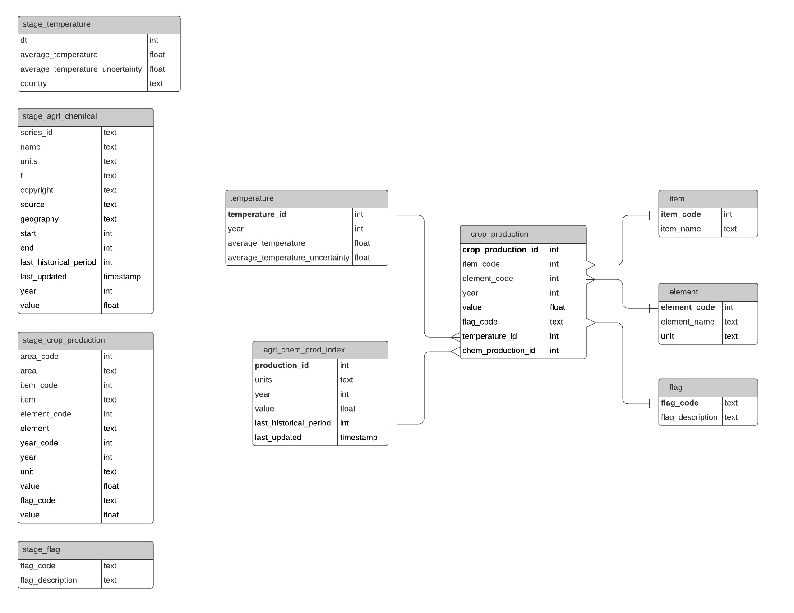

# Data Engineering Nanodegree Capstone Project

## Project overview

The objective of this project is to build an analytics database for
agriculture-related data in the United States.

This database will be helpful to find answers for questions such as:

- How has crop production in United States changed over the years?

- What are the most produced crops in the country? Do they change over time?

- Is there any correlation between crop production and temperature or agriculture chemical production?

## Data sources

- Country-level annual production of various crops by FAO
    - CSV fomat
    - More than 2 million lines
    - Source: http://www.fao.org/faostat/en/#data/QC

- Definition of flags of FAO crop production data
    - CSV format
    - Source: http://www.fao.org/faostat/en/#data/QC
    - Downloaded together with the FAO crop production data

- Country-level monthly land temperature data
    - CSV format
    - Source: https://www.kaggle.com/berkeleyearth/climate-change-earth-surface-temperature-data

- Country-level annual agricultural chemical production index by EIA (Short-term energy outlook category)
    - JSON format
    - Source : https://www.eia.gov/opendata/bulkfiles.php

## Schema design

The four tables on the left contain data that are loaded from data files in S3.
The six tables on the right are the analytics tables. The `temperature`,
`agri_chem_prod_index`, `item`, `element`, and `flag` tables are the dimension
tables, while the `crop_production` table is the fact table. This data model
allows us to easily find answers to the questions above.

`DISTSTYLE` was set to `all` for the `agri_chem_prod_index`, `item`, `element`,
and `flag` tables because they are relatively small. Doing so will improve the
speed of JOIN operations.

In tables that have `year` column, `year` column is used as the sort key to
improve the performance of year-based searches, which is likely to be done
frequently by the database users.

## Data dictionary

- `temperature`
    - `temperature_id`: unique identifier of the row
    - `year`: year
    - `average_temperature`: annual average temperature
    - `average_temperature_uncertainty`: annual average temperature uncertainty

- `agri_chem_prod_index`
    - `production_id`: unique identifier of the row
    - `units`: unit of measurement
    - `year`: year
    - `value`: annual agricultural chemical production index
    - `last_historical_period`: the latest year with historical data
    - `last_updated`: the time the data was last updated

- `item`
    - `item_code`: unique identifier of the row
    - `item_name`: name of the crop item

- `element`
    - `element_code`: unique identifier of the row
    - `element_name`: name of the element i.e. metrics of measurement of crop production

- `flag`
    - `flag_code`: unique identifier of the row
    - `flag_description`: description of the flag - an indicator of how the crop production data are obtained

- `crop_production`
    - `crop_production_id`: unique identifier of the row
    - `item_code`: foreign key to join with `item` table
    - `element_code`: foreign key to join with `element` table
    - `year`: year
    - `value`: annual crop production
    - `flag_code`: foreign key to join with `flag` table
    - `temperature_id`: foreign key to join with `temperature` table
    - `chem_production_id`: foreign key to join with `agri_chem_prod_index` table

## Steps taken / data pipeline

1. Annual agricultural chemical production index is first extracted from the json file in S3, saved into a csv file, and uploaded to S3. Then, the csv data is copied to staging table.

2. At the same time, the other csv files are copied to their respective staging tables.

3. Data quality checks are run on each staging table to ensure that data are copied successfully.

4. Data are inserted from the staging tables to the dimension tables. For the temperature tables, the monthly temperatures are averaged and the monthly uncertainties are summed to create annual average temperature and annual uncertainty.

5. Data quality checks are run on each dimension table to ensure that data are inserted successfully.

6. Crop production fact table is then populated by joining data from dimension and staging tables.

7. Data quality check is run on the fact table to ensure that data are inserted successfully.

## Choice of technologies

Airflow was chosen as the pipeline tool because it provides an easy way to
manage ETL tasks and create workflows using DAGs. Data pipelines can be created
by organising individual tasks and their dependencies. Schedules can then be set
up to execute the pipelines automatically. In addition, alert can also be set
up to inform the pipeline creator about any failure of DAG runs.

S3 was used to store raw data files because it provides a low-cost storage
space and allows us to store a large amount of data and not worry about storage
limit as the data increases.

Redshift was selected as the data warehouse tool because it can be easily
scaled according to the data size and number of users. The data also can be
queried using SQL-based queries, which makes it user-friendly for people who
have background in SQL. In addition, it has built-in capability to load data
directly from S3, allowing easy set-up of data transfers from S3 to Redshift.

## Scenarios

Some possible scenarios when scaling and potential solutions:

- The data was increased by 100x.
    - Redshift will be able to handle this through the addition of more nodes or changing of node types.
    - Storing data on S3 also means we do not need to worry about storage capacity for raw data.

- The pipelines would be run on a daily basis by 7 am every day.
    - The Airflow DAG execution time can be scheduled to run accordingly, with email notification in case the DAG run fails.

- The database needed to be accessed by 100+ people.
    - More nodes can be added to increase the computing capacity, which will help handle more queries.
    - The distribution style and sorting method of data in Redshift tables can be designed according to the frequently-run queries.

## References:
- https://docs.aws.amazon.com/redshift/latest/dg/r_COPY.html
- https://docs.aws.amazon.com/redshift/latest/dg/copy-parameters-data-source.html
- https://docs.aws.amazon.com/redshift/latest/dg/copy-parameters-data-format.htm
- https://stackoverflow.com/questions/22109840/string-contains-invalid-or-unsupported-utf8-codepoints-bad-utf8-hex-sequence
- https://docs.aws.amazon.com/redshift/latest/dg/r_REPLACE.html
- https://docs.aws.amazon.com/redshift/latest/dg/c_best-practices-best-dist-key.html
- https://towardsdatascience.com/getting-started-with-apache-airflow-df1aa77d7b1b
- https://airflow.apache.org/docs/stable/
- https://airflow.readthedocs.io/en/stable/_modules/airflow/hooks/S3_hook.html
- https://stackoverflow.com/questions/52149840/how-to-perform-s3-to-bigquery-using-airflow
- https://airflow.apache.org/docs/stable/howto/operator/python.html
